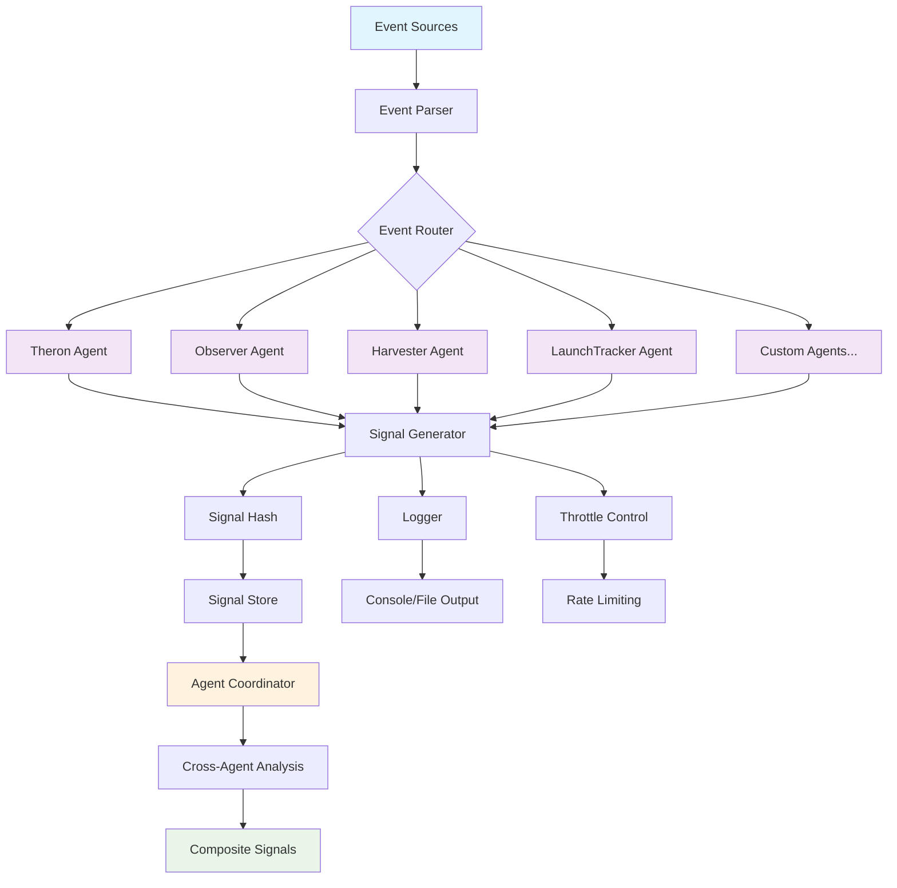

# Eremos

[](LICENSE)
[](https://typescriptlang.org/)
[](https://github.com/Theideabased/Eremos/actions)
[](#contributing)


**Autonomous swarm agents for early on-chain signal detection**

Eremos is a lightweight framework for deploying modular agents that monitor blockchain activity - tracking wallet clusters, mint patterns, and contract anomalies.
Designed for devs who want low-noise, early signals embedded into their workflows.

---

<p align="center">
  <br/>
  <em>Theron - Agent (000)</em>
</p>

**Meet Theron - Agent-000**  
*The first deployed agent in the swarm. Passive. Pattern-sensitive.  
Modular and extendable by design.*

**Agent-001 Coming Soon** [Teaser](https://x.com/EremosCore/status/1949154939923833239)

---

## Table of Contents
- [Features](#features)
- [Architecture Overview](#architecture-overview)
- [Example Signal](#example-signal)
- [Signal Confidence](#signal-confidence)
- [Getting Started](#getting-started)
- [Run](#run)
- [Key Folders](#key-folders)
- [Add a new agent](#add-a-new-agent)
- [Agent Coordination (New Feature)](#agent-coordination-new-feature)
- [Signal Analytics & Alerting (New Feature)](#signal-analytics--alerting-new-feature)
- [Tech Stack](#tech-stack)
- [Architecture and Docs](#architecture-and-docs)
- [Contributing](#contributing)
- [License](#license)
- [Links](#links)

## Features

- **Modular Agents** - Scoped logic for detecting wallet activity, contract spawns, and anomalies  
- **Signal Emission** - Structured signals for logging, alerting, or downstream use  
- **Swarm Design** - Each agent operates independently with shared utilities  
- **Extensible Core** - Plug in watchers, inference layers, or custom triggers  
- **Minimal Output** - Log only what matters
- **Launch Wallet Detection** - Agents can trace freshly funded wallets (e.g. from CEXs), track their contract interactions, and flag high-confidence deploys in real time
- **Ghost Watcher** - Monitors long-dormant wallets that suddenly become active again. Useful for tracing old dev wallets or rug setups
- **Agent Coordination** - Cross-agent signal correlation and collaborative pattern detection
- **Real-time Analytics** - Signal metrics, trends, and performance monitoring
- **Intelligent Alerting** - Configurable alert rules for critical events and patterns
- **Data Export** - JSON/CSV export for external analysis and integration

---

## Architecture Overview



The architecture follows a modular event-driven design:

1. **Event Sources**: RPC watchers, mempool filters, and blockchain triggers
2. **Event Processing**: Centralized parsing and routing to relevant agents
3. **Agent Layer**: Independent agents with specialized detection logic
4. **Signal Generation**: Standardized signal creation with hashing and throttling
5. **Agent Coordination**: Cross-agent pattern correlation for enhanced detection
6. **Output Management**: Structured logging and signal persistence

---

## Example Signal

An example signal emitted by an agent detecting a live token deployment:

```ts
[agent-observer] → fresh funding detected from kraken (wallet: 6Yxk...P2M8) at 04:41:12Z
[agent-observer] → contract probing detected within 4s (pump.fun interaction traced)
[agent-observer] → token created at 04:41:17Z (tx: 5gW...pump)
[agent-observer] → 5 bundle-linked wallets interacted within 8s of deploy
[agent-observer] → launch confidence spike (0.91) - emitting signal (elapsed: 13s)

{
  agent: "Observer",
  type: "launch_detected",
  glyph: "Δ",
  hash: "sig_c7f9a3d2bc",
  timestamp: "2025-06-12T04:41:25Z",
  source: "agent-observer",
  confidence: 0.91
}
```

### Signal Confidence

Each emitted signal includes a `confidence` score (0-1) based on behavioral heuristics:
- CEX-origin funding (e.g. Kraken, Coinbase)
- Time between funding → deploy
- Wallet linkage density (bundled activity)
- Token metadata validation

Confidence is computed via agent-side scoring and logged alongside the signal.

---

## Getting Started

```bash
git clone https://github.com/EremosCore/Eremos.git
cd Eremos
npm install
npm run typecheck
npm test
```

Set up your environment:

```bash
cp .env.example .env.local
npm run dev
```

---

## Run

- **Interactive Demo**: See the complete agent coordination and analytics system in action
  ```bash
  npm run demo
  ```

- **Dev mode** (placeholder):
  ```bash
  npm run dev
  ```

- **List available agents**:
  ```bash
  npm run agents:list
  ```

- **Export agent memory**:
  ```bash
  npm run agents:export
  ```

- **Example: generate a signal hash**
  ```ts
  import { generateSignalHash } from "./utils/signal";
  console.log(generateSignalHash("wallet_activity"));
  ```

---

## Key Folders

- `/agents` - Agent templates + logic  
- `/utils` - Shared signal/logging utilities  
- `/types` - TypeScript interfaces + definitions  
- `/scripts` - Bootstrap and dev scripts  
- `/docs` - Swarm structure, architecture, & our artwork/official whitepaper

---

## Add a new agent

Create a file in `agents/` and implement the `Agent` interface from `types/agent.ts`.

```ts
import { Agent } from "../types/agent";
import { generateSignalHash } from "../utils/signal";
import { logSignal } from "../utils/logger";

export const MyAgent: Agent = {
  id: "agent-myagent",
  name: "MyAgent",
  role: "template",
  glyph: "Δ",
  watchType: "wallet_activity",
  triggerThreshold: 1,
  lastSignal: null,
  originTimestamp: new Date().toISOString(),
  description: "Monitors interesting on-chain patterns.",
  observe: (event) => {
    if (event?.type === "wallet_activity") {
      const hash = generateSignalHash("wallet_activity");
      logSignal({ agent: "MyAgent", type: "template_log", glyph: "Δ", hash, timestamp: new Date().toISOString() });
    }
  },
};
```

---

## Agent Coordination (New Feature)

The Agent Coordination system enables agents to share intelligence and detect complex patterns that require multiple perspectives.

### Cross-Agent Signal Correlation

```ts
import { AgentCoordinator } from "./utils/coordinator";
import { Signal } from "./types/signal";

// Example: Detecting coordinated wallet funding + rapid deployment pattern
const coordinator = new AgentCoordinator();

// LaunchTracker detects CEX funding
coordinator.registerSignal({
  agent: "LaunchTracker",
  type: "cex_funding_detected",
  confidence: 0.85,
  metadata: { wallet: "6Yxk...P2M8", source: "kraken" }
});

// Observer detects rapid contract interactions
coordinator.registerSignal({
  agent: "Observer", 
  type: "rapid_deployment",
  confidence: 0.78,
  metadata: { wallet: "6Yxk...P2M8", contracts: ["pump.fun"] }
});

// Coordinator correlates signals and emits composite signal
if (coordinator.correlateSignals(["cex_funding_detected", "rapid_deployment"])) {
  coordinator.emitCompositeSignal({
    type: "coordinated_launch_pattern",
    confidence: 0.95,
    contributingAgents: ["LaunchTracker", "Observer"],
    pattern: "cex_funded_rapid_deploy"
  });
}
```

### Benefits

- **Enhanced Detection**: Combine multiple agent perspectives for higher confidence
- **Reduced False Positives**: Cross-validation between agents
- **Pattern Evolution**: Learn from agent interactions to detect new patterns
- **Temporal Correlation**: Track patterns across time windows

### Implementation

The coordinator maintains a sliding window of recent signals and applies correlation rules to identify meaningful patterns. This enables detection of sophisticated strategies that individual agents might miss.

---

## Signal Analytics & Alerting (New Feature)

The Signal Analytics system provides real-time monitoring, metrics, and intelligent alerting for the agent swarm.

### Real-time Signal Monitoring

```ts
import { SignalAnalytics } from "./utils/analytics";

const analytics = new SignalAnalytics();

// Add signals from agents
analytics.addSignal({
  type: "launch_detected",
  hash: "sig_abc123",
  timestamp: new Date().toISOString(),
  source: "LaunchTracker",
  confidence: 0.92,
  metadata: { wallet: "6Yxk...P2M8", cexSource: "kraken" }
});

// Get comprehensive metrics
const metrics = analytics.getMetrics(24 * 60 * 60 * 1000); // Last 24 hours
console.log(metrics);
/*
{
  totalSignals: 147,
  signalsByType: { "launch_detected": 23, "rapid_deployment": 31, ... },
  signalsByAgent: { "LaunchTracker": 45, "Observer": 38, ... },
  averageConfidence: 0.847,
  signalsPerHour: 6.12,
  topPatterns: [
    { pattern: "cex_funded_rapid_deploy", count: 12, confidence: 0.91 },
    { pattern: "ghost_wallet_activation", count: 8, confidence: 0.83 }
  ],
  timeRange: { start: "2025-08-12T20:30:00Z", end: "2025-08-13T20:30:00Z" }
}
*/
```

### Custom Alert Rules

```ts
// Add custom alert for high-value transactions
analytics.addAlertRule({
  id: 'high_value_transaction',
  name: 'High Value Transaction Alert',
  condition: (signal) => 
    signal.type === 'wallet_activity' && 
    (signal.metadata?.value || 0) > 1000000, // >1M
  priority: 'high',
  cooldown: 60000, // 1 minute
  enabled: true,
  description: 'Triggers on transactions >1M in value'
});

// Built-in alerts include:
// - High confidence launch detection (>90%)
// - Coordinated pattern alerts
// - Ghost wallet reactivation (dormant >180 days)
// - Rapid deployment bursts (>5 contracts/minute)
```

### Signal Trends & Export

```ts
// Get hourly signal trends
const trends = analytics.getSignalTrends(24); // Last 24 hours
trends.forEach(trend => {
  console.log(`${trend.hour}: ${trend.count} signals, avg confidence: ${trend.avgConfidence.toFixed(3)}`);
});

// Export metrics for external analysis
const jsonExport = analytics.exportMetrics('json');
const csvExport = analytics.exportMetrics('csv');

// Get recent signals for debugging
const recent = analytics.getRecentSignals(10);
```

### Benefits

- **Real-time Monitoring**: Track swarm performance and signal quality
- **Intelligent Alerting**: Configurable rules for important events
- **Pattern Analysis**: Identify trending behaviors and anomalies
- **Data Export**: Integration with external analytics tools
- **Performance Insights**: Agent efficiency and signal distribution metrics

---

## Tech Stack

- **Frontend:** Next.js, Tailwind CSS
- **Backend:** Node.js (TypeScript-based agent runner)
- **Language:** TypeScript (typed logic across agents, utils, and infra)
- **Chain Layer:** RPC watchers, mempool filters, native triggers

---

## Architecture and Docs

- Agents: `docs/agents.md`
- Signals: `docs/signals.md`
- Runtime: `docs/runtime.md`
- Glyphs: `docs/glyphs.md`
- Throttle: `docs/throttle.md`
- Events: `docs/events.md`
- Memory: `docs/memory.md`
- Metrics: `docs/metrics.md`

---

## Contributing

We're open to contributors.  
If you are experienced in TypeScript and like agent-based systems, check `example.ts` and build your own observer.
If you're a designer, artist, or just have ideas that fit the mythos - send us a DM on Twitter. [@EremosCore](https://x.com/EremosCore)

- Keep PRs small and focused
- Run `npm run typecheck && npm test` before pushing
- Ensure README links and examples work

---

## License

MIT © Eremos LLC

---

## Links

- **Twitter/X:** [@EremosCore](https://x.com/EremosCore)
- **Website:** [Eremos.io](https://www.eremos.io/)
- **Whitepaper:** [v1.0 PDF](docs/whitepaper.pdf)

_Maintained by the Eremos Core team 💛._
